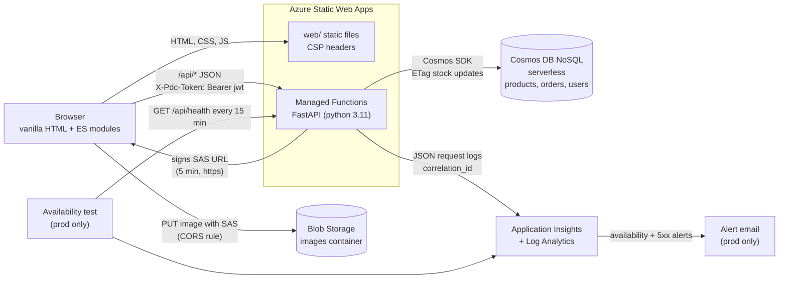
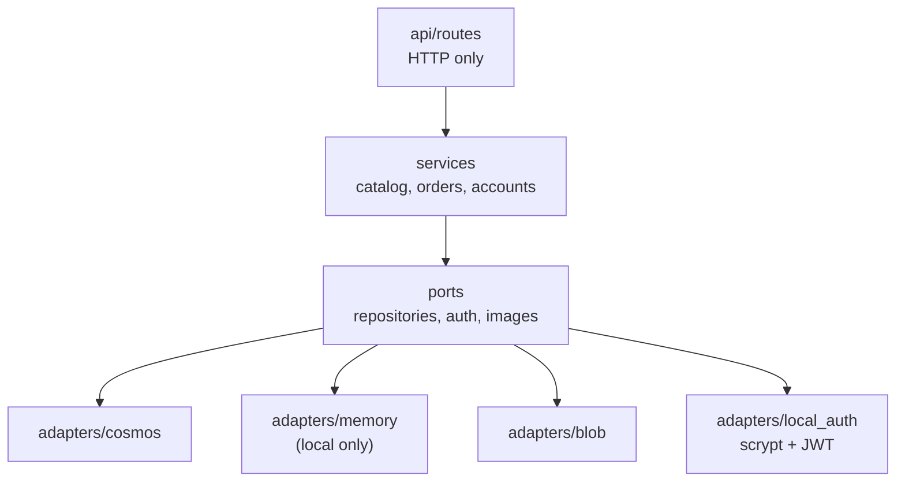

# Architecture

Mermaid source. GitHub renders it in the preview.

```mermaid
flowchart LR
    Browser["Browser<br/>vanilla HTML + ES modules"]
    subgraph SWA["Azure Static Web Apps"]
        Static["web/ static files<br/>CSP headers"]
        Func["Managed Functions<br/>FastAPI (python 3.11)"]
    end
    Cosmos[("Cosmos DB NoSQL<br/>serverless<br/>products, orders, users")]
    Blob[("Blob Storage<br/>images container")]
    AI["Application Insights<br/>+ Log Analytics"]
    Probe["Availability test<br/>(prod only)"]
    Mail["Alert email<br/>(prod only)"]

    Browser -->|"HTML, CSS, JS"| Static
    Browser -->|"/api/* JSON<br/>X-Pdc-Token: Bearer jwt"| Func
    Func -->|"Cosmos SDK<br/>ETag stock updates"| Cosmos
    Func -->|"signs SAS URL<br/>(5 min, https)"| Browser
    Browser -->|"PUT image with SAS<br/>(CORS rule)"| Blob
    Func -->|"JSON request logs<br/>correlation_id"| AI
    Probe -->|"GET /api/health every 15 min"| Func
    Probe --> AI
    AI -->|"availability + 5xx alerts"| Mail
```

## Layers inside the API

```mermaid
flowchart TB
    Routes["api/routes<br/>HTTP only"] --> Services["services<br/>catalog, orders, accounts"]
    Services --> Ports["ports<br/>repositories, auth, images"]
    Ports --> Cosmos["adapters/cosmos"]
    Ports --> Memory["adapters/memory<br/>(local only)"]
    Ports --> BlobA["adapters/blob"]
    Ports --> Auth["adapters/local_auth<br/>scrypt + JWT"]
```
