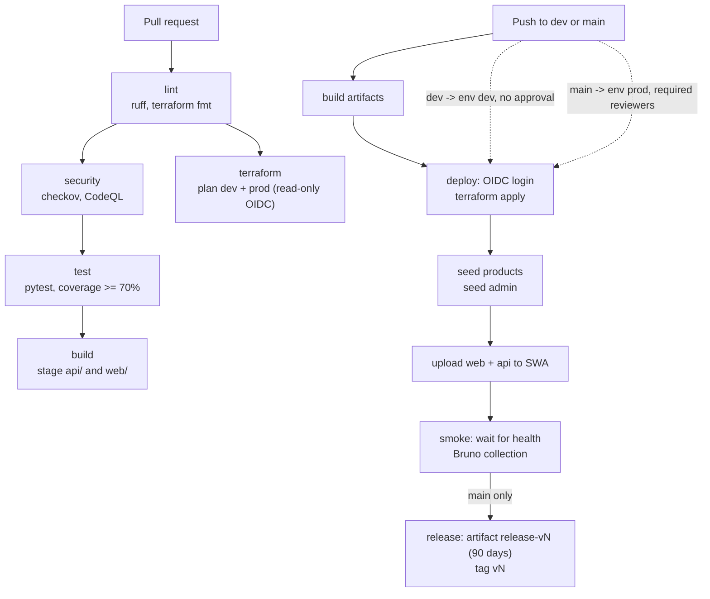

# CI/CD pipeline

Mermaid source. GitHub renders it in the preview.

```mermaid
flowchart TD
    PR["Pull request"] --> Lint["lint<br/>ruff, terraform fmt"]
    Lint --> Sec["security<br/>checkov, CodeQL"]
    Lint --> TfPlan["terraform<br/>plan dev + prod (read-only OIDC)"]
    Sec --> Test["test<br/>pytest, coverage >= 70%"]
    Test --> Build["build<br/>stage api/ and web/"]

    Push["Push to dev or main"] --> B["build artifacts"]
    B --> Apply["deploy: OIDC login<br/>terraform apply"]
    Apply --> Seeds["seed products<br/>seed admin"]
    Seeds --> Upload["upload web + api to SWA"]
    Upload --> Smoke["smoke: wait for health<br/>Bruno collection"]
    Smoke -->|"main only"| Release["release: artifact release-vN (90 days)<br/>tag vN"]

    Push -.->|"dev -> env dev, no approval"| Apply
    Push -.->|"main -> env prod, required reviewers"| Apply
```

`N` is the workflow run number of `deploy.yml`.
