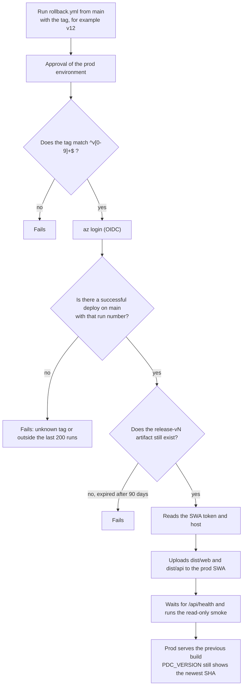

# Application rollback

Mermaid source: GitHub renders it in the preview.

```mermaid
flowchart TD
    Start["Run rollback.yml from main<br/>with the tag, for example v12"] --> Approve["Approval of the prod environment"]
    Approve --> Check{"Does the tag match ^v[0-9]+$ ?"}
    Check -->|no| Fail1["Fails"]
    Check -->|yes| Login["az login (OIDC)"]
    Login --> Find{"Is there a successful deploy on main<br/>with that run number?"}
    Find -->|no| Fail2["Fails: unknown tag or outside the last 200 runs"]
    Find -->|yes| Download{"Does the release-vN artifact still exist?"}
    Download -->|"no, expired after 90 days"| Fail3["Fails"]
    Download -->|yes| Key["Reads the SWA token and host"]
    Key --> Upload["Uploads dist/web and dist/api to the prod SWA"]
    Upload --> Smoke["Waits for /api/health and runs the read-only smoke"]
    Smoke --> Done["Prod serves the previous build<br/>PDC_VERSION still shows the newest SHA"]
```

The rollback does not run Terraform or touch the data.
