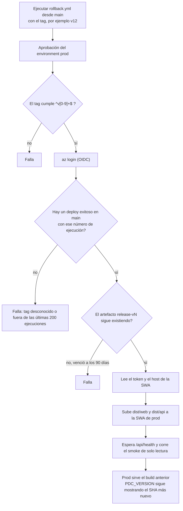

# Rollback de la aplicación

Fuente Mermaid: GitHub la muestra en la vista previa.

```mermaid
flowchart TD
    Start["Ejecutar rollback.yml desde main<br/>con el tag, por ejemplo v12"] --> Approve["Aprobación del environment prod"]
    Approve --> Check{"El tag cumple ^v[0-9]+$ ?"}
    Check -->|no| Fail1["Falla"]
    Check -->|sí| Login["az login (OIDC)"]
    Login --> Find{"Hay un deploy exitoso en main<br/>con ese número de ejecución?"}
    Find -->|no| Fail2["Falla: tag desconocido o fuera de las últimas 200 ejecuciones"]
    Find -->|sí| Download{"El artefacto release-vN sigue existiendo?"}
    Download -->|"no, venció a los 90 días"| Fail3["Falla"]
    Download -->|sí| Key["Lee el token y el host de la SWA"]
    Key --> Upload["Sube dist/web y dist/api a la SWA de prod"]
    Upload --> Smoke["Espera /api/health y corre el smoke de solo lectura"]
    Smoke --> Done["Prod sirve el build anterior<br/>PDC_VERSION sigue mostrando el SHA más nuevo"]
```

El rollback no corre Terraform ni toca los datos.
