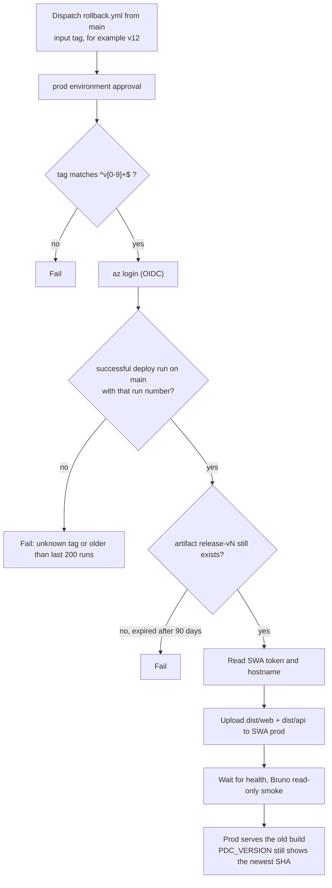

# Rollback

Mermaid source. GitHub renders it in the preview.

```mermaid
flowchart TD
    Start["Dispatch rollback.yml from main<br/>input tag, for example v12"] --> Approve["prod environment approval"]
    Approve --> Check{"tag matches ^v[0-9]+$ ?"}
    Check -->|no| Fail1["Fail"]
    Check -->|yes| Login["az login (OIDC)"]
    Login --> Find{"successful deploy run on main<br/>with that run number?"}
    Find -->|no| Fail2["Fail: unknown tag or older than last 200 runs"]
    Find -->|yes| Download{"artifact release-vN still exists?"}
    Download -->|"no, expired after 90 days"| Fail3["Fail"]
    Download -->|yes| Key["Read SWA token and hostname"]
    Key --> Upload["Upload dist/web + dist/api to SWA prod"]
    Upload --> Smoke["Wait for health, Bruno read-only smoke"]
    Smoke --> Done["Prod serves the old build<br/>PDC_VERSION still shows the newest SHA"]
```

Rollback does not run Terraform and does not touch data.
